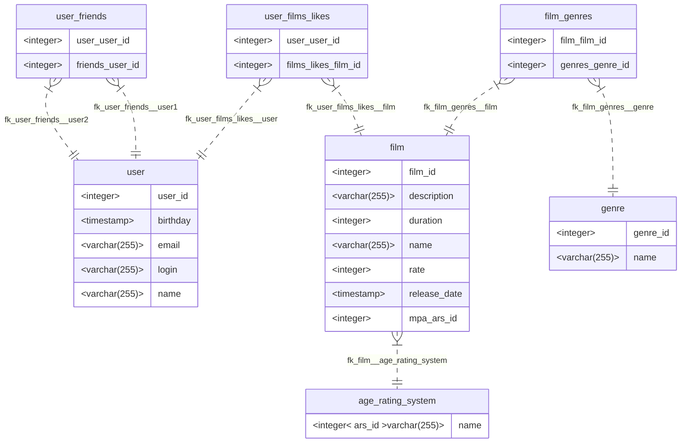

# java-filmorate
Template repository for Filmorate project.

## Database storage scheme

```mermaid
---
DB scheme
---
erDiagram
	user_films_likes{
	    ~integer~ user_user_id
	    ~integer~ films_likes_film_id
	}
	age_rating_system{
	    ~integer~ ars_id ~varchar(255)~ name
	}
	user{
	    ~integer~ user_id
	    ~timestamp~ birthday
	    ~varchar(255)~ email
	    ~varchar(255)~ login
	    ~varchar(255)~ name
	}
	user_friends{
	    ~integer~ user_user_id
	    ~integer~ friends_user_id
	}
	film{
	    ~integer~ film_id
	    ~varchar(255)~ description
	    ~integer~ duration
	    ~varchar(255)~ name
	    ~integer~ rate
	    ~timestamp~ release_date
	    ~integer~ mpa_ars_id
	}
	film_genres{
	    ~integer~ film_film_id
	    ~integer~ genres_genre_id
	}
	genre{
	    ~integer~ genre_id
	    ~varchar(255)~ name
	}
	film }|..|| age_rating_system : fk_film__age_rating_system
	film_genres }|..|| genre : fk_film_genres__genre
	film_genres }|..|| film : fk_film_genres__film
	user_films_likes }|..|| film : fk_user_films_likes__film
	user_films_likes }|..|| user : fk_user_films_likes__user
	user_friends }|..|| user : fk_user_friends__user1
	user_friends }|..|| user : fk_user_friends__user2
```